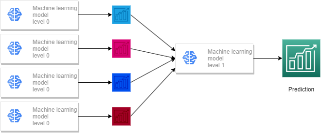

# Timeseries prediction models. 

*author: Peter Lawrence*
*date: 2.10.2023*

## ARIMA (AutoRegressive Integrated Moving Average)

This is an algorithem that is based on ARMA. The difference is that this model can be used on data that is non-stationary. 

> ***Non-stationary data** has a change in the statistical properties over time such as mean and average. It does not have a increasing or decreasing trend in these values. ARIMA can be used as regular ARMA.*

### Positives
- Uses relations between observarions and lagged observations
    - might not actually be that positive since we look at hour by hour predictions based on hourly estimated weather values. 
- Lots of documentation and many libraries

### resources: 
- [ARIMA for TS Forecasting](https://machinelearningmastery.com/arima-for-time-series-forecasting-with-python/)

## Prophet (by facebook)

### Positives ++
- Suitable for usage on seasonal timeseries.
- Simple installation and lightweight to run
- Easy to plot components of prediction for interpretability
- Works perfectly fine with NaN data. (Can come in handy for anomalies)
- Very good documentation

### Negatives --
- Seems to vary in accuracy and stability in forecast
- Seems to strugle with very local seasonality such as weekly or hourly. (not confirmed)

### Some resources: 

- [Prophet forecasting stocks](https://medium.com/mlearning-ai/multivariate-time-series-forecasting-using-fbprophet-66147f049e66)
- [Some simple research into prophet](https://www.artefact.com/blog/is-facebook-prophet-suited-for-doing-good-predictions-in-a-real-world-project/)
- [Documentation](https://facebook.github.io/prophet/docs/outliers.html)
## Tensorflow (by Google)

Deep neural network by google. Works on many different kinds of data. Could be interesting to see how it works on our dataset just for fun. 

### Positives ++
- Great visualisations
- Great debugging using tensorboard
- Hardware acceleration library (uses GPU as well)

### Negatives --
- Some complexity
- no windows support

### Resources:
- [Advantages / Disadvantages of Tensorflow](https://www.geeksforgeeks.org/advantages-and-disadvantages-of-tensorflow/)

## Ensemble Models

Ensemble models uses multpile machine learning models or same models with different data and correlates the predictions from these models into one prediction. It intends to increase the accuracy of any single model and improve the stability of the predictions. 

Running multiple models may help with reducing noise and also bias towards weighting of features for the prediction. 

There are some different ways or teqniwues of ensemble modelling: 

1. **Bagging**
    - uses bootstrapping, as in random forest. The data is split up into subsets with replacement. 
2. **Boosting**
    - Instead of paralell fitting of models we have several model in sequential order: 

>
>
>Sequential model

3. **Stacking**
    - Similar to boosting but also uses paralell models. Probably possible to nest a lot more than two levels, but for this project two levels might be more than enough. The `Level 1` model in the illustration below corresponds to the stacking model. 

> 
>
> Stacking model

4. **Blending**
    - Similar to stacking only learns from the validation and test set as it goes (continously learning?? Not sure about this one)

### Aggregating multiple predictions in ensemble models

There are mainly three ways of aggregating the prediciton from multiple entities. 
- **Max Voting:** This uses majority voting for classification problems (not suited for our project since we dont operate with binary values)
- **Averaging:** Typically used for regression problems where we average predictions. 
- **Weighted average:** Weitghts to the results from the different algorithms. Weights can be calculated based on all predictions from all models if we can find combinations in the dataset. Typically found in feature engineering and observations in the dataset. 

## Anomaly detection

Probably not that relevant for our project

Anomaly detectios identifies rare events and / or observations that are statistically different from all observations. Used to indicate errors in systems like credit card fraud, failing servers, cyber attack etc. 

Three main categories
1. Point anomaly: *A tuple in a dataset that is far off from the rest of the data*
2. Contextual Anomaly: *Anomaly that happens because of the context of the observation*
3. Collective Anomaly: *Anomaly that happens for a group of datapoints where single datapoints looks normal but together creates strange or unexpected patterns*

Maybe we could use this to purge the dataset automatically of values that are extreme for better performance, but this should not be first priority. 